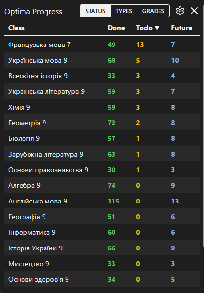
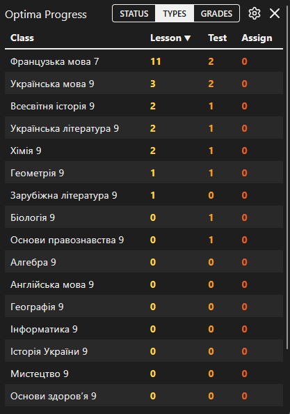
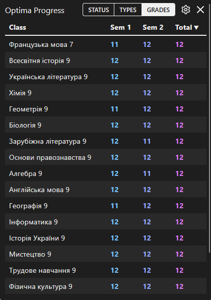

# optima-progress-tracker

shows in a nice table the number of lessons you have done, have to do and will have to do in the future. you can also see tables for lesson types and approximate semester grades (THEY MAY AND PROBABLY ARE WRONG, CHECK YOUR TABEL GIVEN BY OPTIMA INSTEAD).

designed specifically for optima school, but works on any moodle dashboard actually. (css classes, used to detect elements, will probably need to be changed. so it's not certain that it'll work)

---

показує в красивій таблиці кількість уроків що ти зробив, повинен зробити і потрібно буде робити. ти також можеш побачити таблиці для типів уроків та приблизні семестрові оцінки (ВОНИ МОЖУТЬ ТА МАБУТЬ Є НЕПРАВИЛЬНИМИ, КРАЩЕ ДИВІСТЬСЯ НА СВІЙ ТАБЕЛЬ ВІД ОПТІМИ).

розроблено спеціально для школи optima, але насправді працює на будь-якій панелі керування moodle. (класи css, що використовуються для виявлення елементів, ймовірно, потребуватимуть змін. тому не факт, що буде працювати)

---

  <table border="0">
    <tr>
      <td align="center" valign="middle">
        
      </td>
      <td align="center" valign="middle">
        
      </td>
      <td align="center" valign="middle">
        
      </td>
    </tr>
  </table>

# install (завантаження)

### chrome / chromium (brave, edge, vivaldi)

1. download the latest `optima-progress-tracker_chrome_X.Y.zip` from releases.
2. extract the archive into a folder.
3. go to `chrome://extensions`.
4. enable **developer mode** (top right).
5. click **load unpacked** and select the folder you extracted.

---

1. завантаж останній `optima-progress-tracker_chrome_X.Y.zip` з розділу releases.
2. розпакуй архів у папку.
3. перейди на сторінку `chrome://extensions`.
4. увімкни **режим розробника** (developer mode) у верхньому правому куті.
5. натисни **load unpacked** (завантажити розпаковане розширення) і вибери свою папку.

### firefox

firefox is not publicly supported yet. if you want to use it, you must load it as a temporary add-on via `about:debugging`, put it yourself on to [mozilla add-on developer hub](https://addons.mozilla.org/en-us/developers/), or dm me for help.

---

firefox наразі офіційно не підтримується для публічного завантаження просто так. якщо хочеш спробувати, завантажуй як тимчасове розширення через `about:debugging`, сам виставляй на [mozilla add-on developer hub](https://addons.mozilla.org/en-us/developers/), або пиши мені в особисті і я можу тобі допомогти.

# help (допомога)

if you have found any bugs, have issues, or feature suggestions, dm me at telegram `@the_captivator`

---

якщо ти знайшов баги, маєш проблеми, чи маєш ідею для нової функції, пиши мені особоисті в телеграм `@the_captivator`

# build and release

**depending on whether you test/build for firefox or chrome, make a copy of `manifest.firefox.json` or `manifest.chrome.json` into the `src/` folder, and name it as `manifest.json`. also, _keep both manifests the same_**

unfortunately, they are not interchangeable, and i am lazy to make a build system, so just do it manually like this.

## build

to test the extension, go to `about:debugging#/runtime/this-firefox` and load the `manifest.json` as a temporary extension. or go to extensions in chrome, click `load unpacked` and select the `src/` folder (assuming you have copied and renamed the correct `manifest.json` into it).

for dev, you just copy the manifest of your choice into `src/`, then load that. do changes, hit reload. that way you can test the extension.

## release

to release the extension:

- increment the `version` in both `manifest.chrome.json` and `manifest.firefox.json` above the `src/` folder.
- commit your changes under the name: `release (vX.Y): ...` (where `X` is major release, usually `1`, and `Y` is minor release).
- copy the target manifest into `src/` as `manifest.json`.
- put everything inside `src/` into a `.zip` archive with the following name: `optima-progress-tracker_browser_x.y.zip`.
- put the zip inside `releases/`. `browser` is either `chrome` or `firefox`.
- tag the release with `git tag -a vX.Y -m "release vX.Y: <your message>"` and then `git push origin vX.Y`

### distribution

- **firefox:** go to [mozilla add-on developer hub](https://addons.mozilla.org/en-us/developers/) and upload the zip. i currently keep this unlisted for myself. if you want to use this extension on firefox, you'll have to do this process as well yourself, or wait until i make it public.
- **chrome:** just upload the zip archive to github releases. i don't feel like uploading this publicly to the web store yet, so i will just keep zip archives here.

## todo

- [ ] upload as public extension to chrome web store (needs $5)
- [ ] upload as public extension to firefox browser add-ons
- [ ] automate releasing (CI/CD) with github actions (for practicing)
